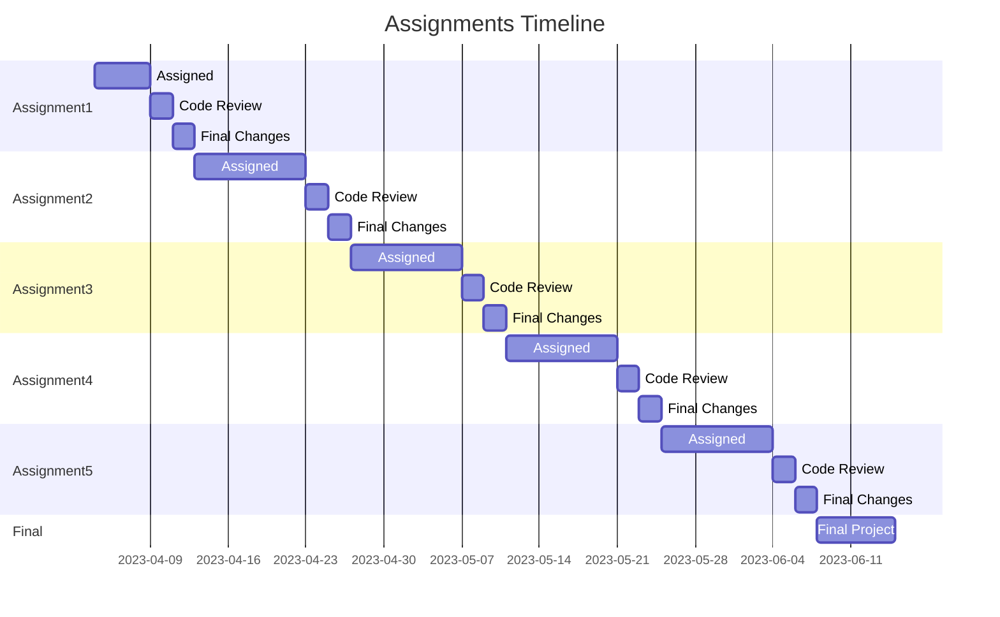

# Assignments

## All this needs to be updated

1. [Assignment 1](Assignment1.md)
   - 100 points +5 EC points
   - Assigned: 9/21
   - Turn in: 9/28 11:59 pm
1. [Assignment 2](Assignment2.md)
   - 100 points +5 EC points
   - Assigned: 9/28
   - Turn in: 10/12 11:59 pm
1. [Assignment 3](Assignment3.md)
   - 100 points +5 EC points
   - Assigned: 10/12
   - Turn in: 10/26 11:59 pm
1. [Assignment 4](Assignment4.md)
   - 100 points +5 EC points
   - Assigned: 10/26
   - Turn in: 11/9 11:59 pm
1. [Assignment 5](Assignment5.md)
   - 100 points +5 EC points
   - Assigned: 11/9
   - Review in class: 11/28 2:00 pm
   - Turn in: 11/28 11:59 pm
1. [Final Project](Final.md)
   - 50 points +50 EC points
   - Assigned: 11/28
   - Final project presentations finals week

If you are having trouble viwing the below graph, copy the code and paste it [in this editor](https://mermaid-js.github.io/docs/mermaid-live-editor-beta)



---

# How homework works

- Add phil@intellitect.com, grant@intellitect.com, jenny.curry@intellitect.com, and meg@intellitect.com as contributors to your Azure Subscription.
- Fork the class repo in your own
- Screenshots of the resource group and each service with relevant data posted to GitHub.
- Readme.md with a link to the resource group with the assignment. Your assignment will be fully contained in a single resource group. All resources for the assignment must be in the resource group. The resource group must be named according to the assignment requirements. Resource groups can be renamed.
- Once your assignment is complete, create a PR against the assignment branch

# How To Submit (Starting 5/4/23)

### Make an Assignment PR against Class Repository

- From your forked repo, checkout to the correct assignement branch and make homework changes in that branch
- When you are ready to make your PR, create a pull request against the class repository assignment branch, attempting to merge in YOUR assignment branch from YOUR forked repo.

- On the PR against the class repo, be sure to add any releveant or required information.

# Grading Breakdown

_The below is subject to change._

```
0-64	F
65-66	D
67-69	D+
70-72	C-
73-76	C
77-79	C+
80-82	B-
83-86	B
87-89	B+
90-94	A-
95+     A
```

Each assignment is a total of 100 points. Assignments may contain up to 10 points of extra credit.
Assignments will also include an additional 10 points that can be awarded to one team per assignment for the best submission.

## Fundamentals (up to 5 points + up to 100% deduction of final grade)

- Code is clean (up to 5 points)
  - Follows best practices.
  - The simplicity first approach is followed.
  - The code is formatted well with out large amounts of whitespace or indenting issues
  - The PR git diff is clean and easy to read (no extra, unrelated files, or messy PR diffs)
- 100% deduction if submission is late (for initial turn in date + Turn in date)
- 50% deduction for broken pipeline with failing unit test by initial turn in date
- 50% deduction for broken website by initial turn in date

## Assignment (100 points)

- Points are distributed among each bulleted assignment instruction with partial credit being possible for all parts of the assignment.

## Extra Credit (up to 5 points)

- These points are given out at the instructor's discretion.
- These may not be given out if the assignment is not completed to a satisfactory level.
- Extra credit is not guaranteed to be avalible on all assignments.
