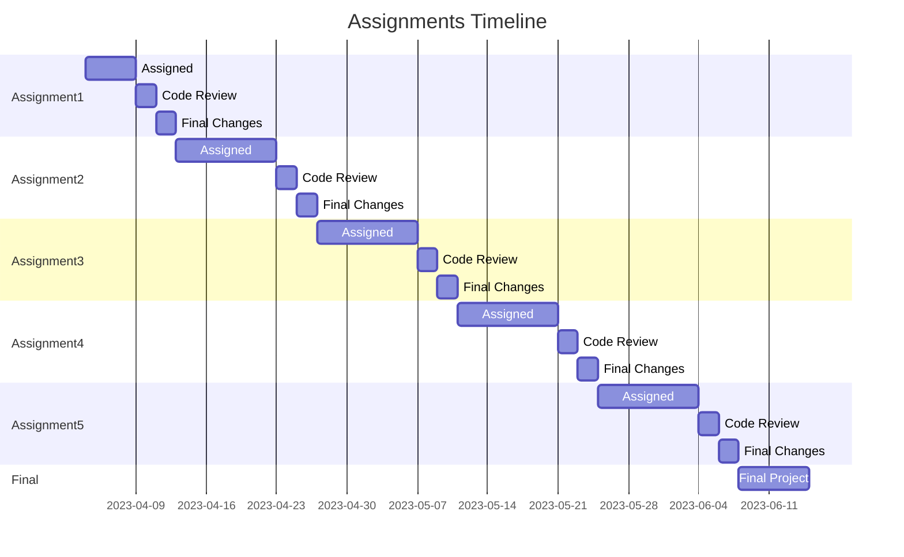

# Assignments

## All this needs to be updated

1. [Assignment 1](Assignment1.md)
   - 100 points +5 EC points
   - Assigned: 4/4
   - Initial work complete: 4/9 11:59 pm
     - 50% for running pipeline with passing unit test
     - 50% for working website
   - Code Reviews Due by: 4/11 11:59 pm
   - Review in class: 4/13 2:00 pm
   - Final turn in: 4/13 11:59 pm
1. [Assignment 2](Assignment2.md)
   - 100 points +5 EC points
   - Assigned: 4/13
   - Initial work complete: 4/23 11:59 pm
     - 50% for running pipeline with passing unit test
     - 50% for working website
   - Code Reviews Due by: 4/25 11:59 pm
   - Review in class: 4/27 2:00 pm
   - Final turn in: 4/27 11:59 pm
1. [Assignment 3](Assignment3.md)
   - 100 points +5 EC points
   - Assigned: 4/27
   - Initial work complete: 5/7 11:59 pm
     - 50% for running pipeline with passing unit test
     - 50% for working website
   - Code Reviews Due by: 5/9 11:59 pm
   - Review in class: 5/11 2:00 pm
   - Final turn in: 5/11 11:59 pm
1. [Assignment 4](Assignment4.md)
   - 100 points +5 EC points
   - Assigned: 5/11
   - Initial work complete: 5/21 11:59 pm
     - 50% for running pipeline with passing unit test
     - 50% for working website
   - Code Reviews Due by: 5/23 11:59 pm
   - Review in class: 5/25 2:00 pm
   - Final turn in: 5/25 11:59 pm
1. [Assignment 5](Assignment5.md)
   - 100 points +5 EC points
   - Assigned: 5/25
   - Initial work complete: 6/4 11:59 pm
     - 50% for running pipeline with passing unit test
     - 50% for working website
   - Code Reviews Due by: 6/6 11:59 pm
   - Review in class: 6/8 2:00 pm
   - Final turn in: 6/8 11:59 pm
1. [Final Project](Final.md)
   - 50 points +50 EC points
   - Assigned: 4/4
   - In class hackathon 6/8
   - Final project presentations finals week

If you are having trouble viwing the below graph, copy the code and paste it [in this editor](https://mermaid-js.github.io/docs/mermaid-live-editor-beta)



---

# How homework works

- Add phil@intellitect.com, grant@intellitect.com, jenny.curry@intellitect.com, and meg@intellitect.com as contributors to your Azure Subscription.
- Fork the class repo in your own
- Screenshots of the resource group and each service with relevant data posted to GitHub.
- Readme.md with a link to the resource group with the assignment. Your assignment will be fully contained in a single resource group. All resources for the assignment must be in the resource group. The resource group must be named according to the assignment requirements. Resource groups can be renamed.
- Once your assignment is complete, create a PR against the assignment branch

# How To Submit (Starting 5/4/23)

### Option 1: Start with the assignment branch

- Only make changes relevant to the homework.
- Do not merge in additional/custom changes that are unrelated to the homework.
- Create a PR from your asssignment in YOUR repo branch to the assignment branch in the class repo (as you typically would)
- On the PR against the class repo, be sure to add the following information to the description:
  - A link to your deployed website & API page
- Your git diff should only show changes relevant to the assignment criteria, any changes outside of that will cause you to lose points for messy code

### Option 2: Make a PR in your own repo

- Branch from your own main and only make homework changes in that branch
- If you want to make other changes, make them in main and merge them into your assignment branch before submitting your PR
- When you are ready to make your initial PR, create a pull request against YOUR main branch in YOUR repo
- After creating your PR in YOUR repo... Submit a pull request from your assignment branch into the class repo (as you typically would)
- On the PR against the class repo, be sure to add the following information to the description:
  - A message saying you want your PR reviewed in YOUR repo
  - A link to the PR in YOUR repo
  - A link to your deployed website & API page
- Your git diff in YOUR pr in YOUR repo (not the PR against the class repo) should only show changes relevant to the assignment criteria, any changes outside of that will cause you to lose points for messy code
  - We know the repo against the class will be messy, that code will not be reviewed. The PR in your repo is the one that will be reviewed
- Here is an example! https://github.com/IntelliTect-Samples/EWU-CSCD379-2023-Spring/pull/70

### PR Reviews:

You will review PRs like normal, the only difference is if you are reviewing a PR that was created in someone elses repo... you will do the review in their repo, and just add a comment on the PR the class repo with a link to your review

---

# Grading Breakdown

_The below is subject to change._

```
0-64	F
65-66	D
67-69	D+
70-72	C-
73-76	C
77-79	C+
80-82	B-
83-86	B
87-89	B+
90-94	A-
95+     A
```

Each assignment is a total of 100 points. Assignments may contain up to 10 points of extra credit.
Assignments will also include an additional 10 points that can be awarded to one team per assignment for the best submission.

## Fundamentals (up to 5 points + up to 100% deduction of final grade)

- Code is clean (up to 5 points)
  - Follows best practices.
  - The simplicity first approach is followed.
  - The code is formatted well with out large amounts of whitespace or indenting issues
  - The PR git diff is clean and easy to read (no extra, unrelated files, or messy PR diffs)
- 100% deduction if submission is late (for initial turn in date + final turn in date)
- 50% deduction for broken pipeline with failing unit test by initial turn in date
- 50% deduction for broken website by initial turn in date

## Assignment (60 points)

- Points are distributed among each bulleted assignment instruction with partial credit being possible for all parts of the assignment.

## Final Corrections (5 points)

- All code review comments addressed

## Peer Review (PR review) (20 points)

- The review should leave helpful inline comments on the code
- Look for a PR with no reviews first
- It is likely each PR will have more than 1 review, so you are also welcome to leave comments ontop of another students review either elaborating further or disagreeing with the review.
- Make sure you review the assignment for each assignment instruction, commenting inline for each portion of the assignment.

## Partnered (10 points)

- 10 points for pairing for the assignment.

## Extra Credit (up to 5 points)

- These points are given out at the instructor's discretion.
- These may not be given out if the assignment is not completed to a satisfactory level.
- Extra credit is not guaranteed to be avalible on all assignments.
